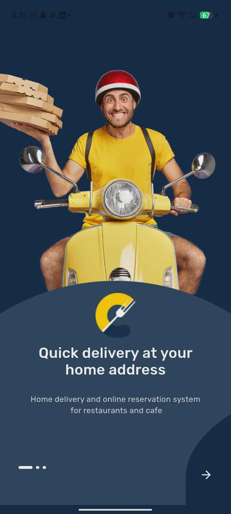
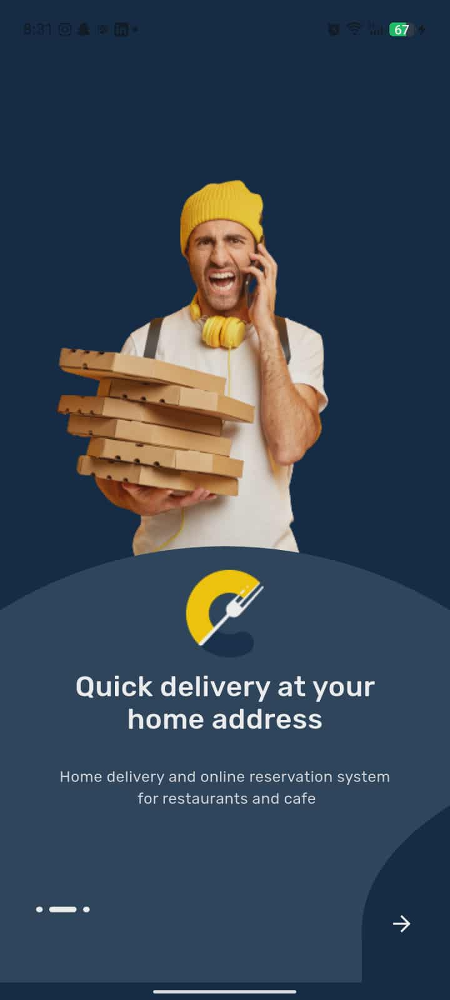
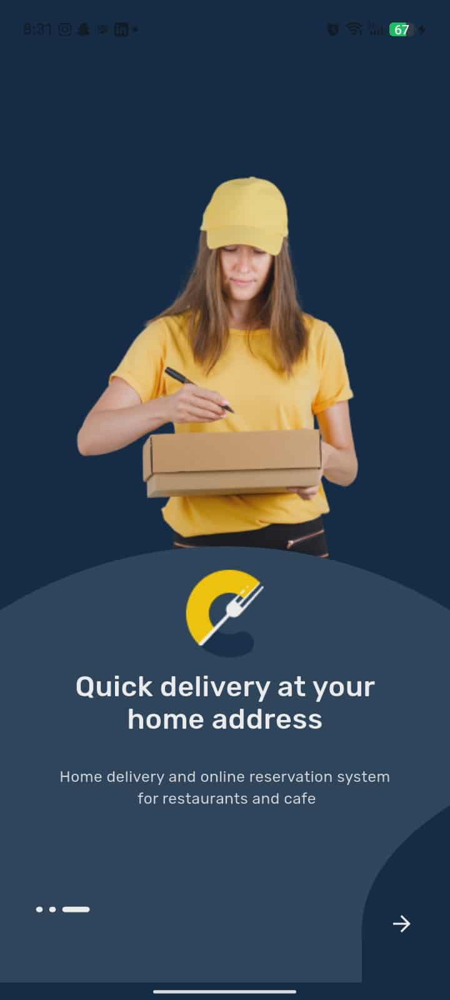
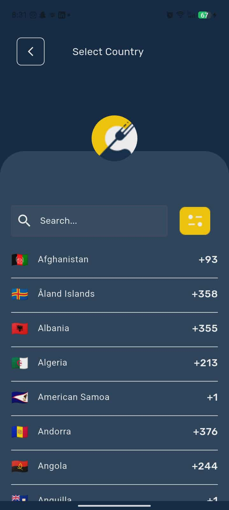
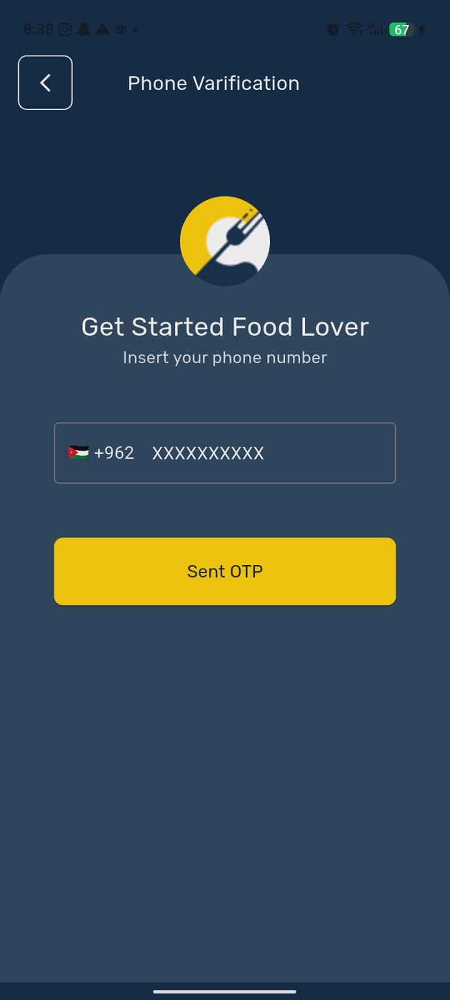
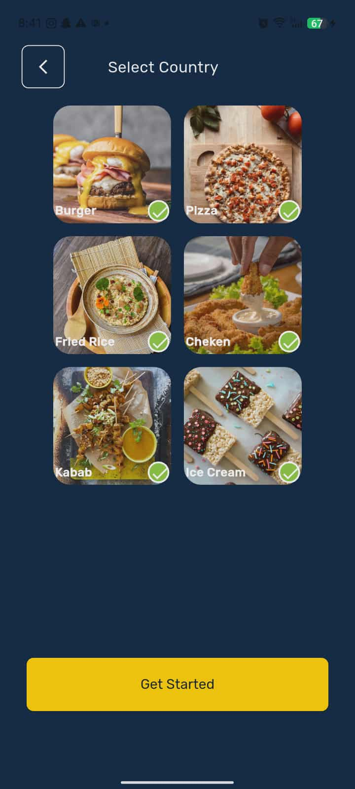
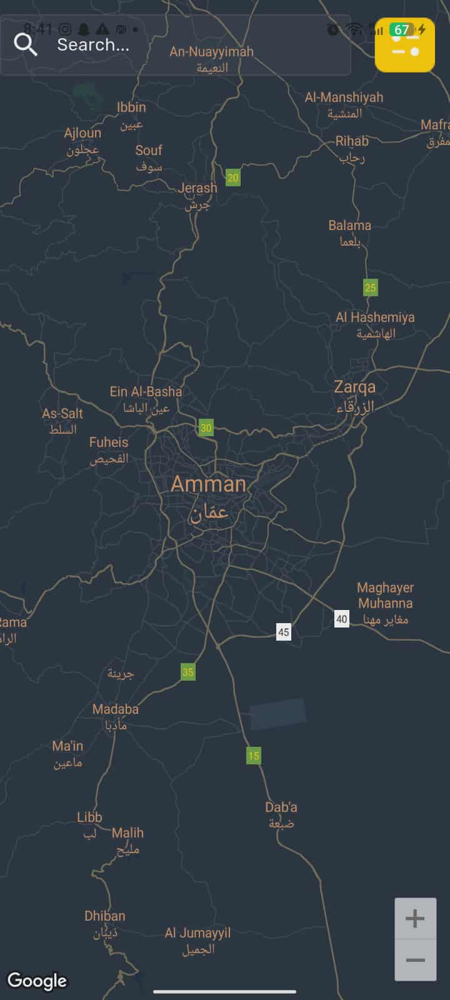

# 🍽️ Food Delivery App – Flutter

A modern mobile application that allows users to browse restaurants, select meals, place delivery orders, and track their order status in real-time.  
The app provides a smooth onboarding experience, phone number authentication via OTP, customizable food categories, and a beautiful dark UI theme.

---

## ✨ Features

| Feature | Description |
|--------|-------------|
| 📲 Onboarding Screens | Engaging welcome screens with smooth transitions |
| 🌍 Country & Phone Input | Select country with flag and auto phone formatting |
| 🔐 OTP Verification | Secure login using Firebase Phone Authentication |
| 🍔 Food Category Selection | Choose favorite food types visually |
| 🗺️ Google Maps Integration | Display user location on an interactive map |
| 💛 Elegant UI | Clean, modern, and easy-to-use interface |
| ⭐ State Management | Built with **Provider** for efficiency and scalability |

---

## 🛠 Tech Stack

| Technology | Purpose |
|------------|---------|
| **Flutter / Dart** | Main development framework |
| **Provider** | State management |
| **Firebase Authentication** | Phone number login (OTP) |
| **Google Maps API** | Display & interact with user location |
| **Material Design UI** | Smooth and modern UX |

---

## 📱 UI Previews

### Onboarding Screens
<p align="center">
  
  
  
</p>

### Country Selection + Number Input   
<p align="center">
  
  
</p>

### OTP Verification
<p align="center">
  
</p>

### Food Category Selection Screen
<p align="center">
  
</p>

### Google Maps Screen
<p align="center">
  
</p>

> **Note:** Replace `YOUR_LINK_HERE` with the actual screenshot URLs.

---

## 🚀 How to Run

```bash
git clone https://github.com/YOUR_USERNAME/YOUR_REPO.git
cd YOUR_REPO
flutter pub get
flutter run
